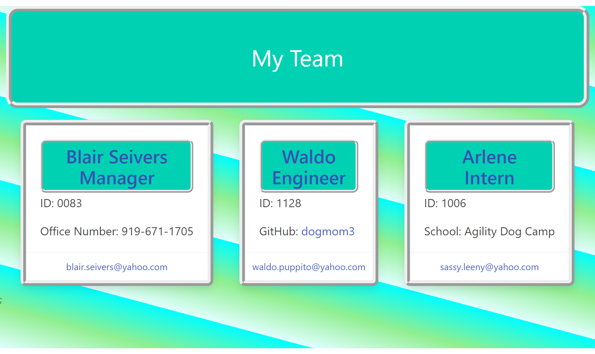

# TEAM PROFILE GENERATOR

## Description
My motivation in creating this file generator is to expand my knowledge with using Node.Js.
I built this project to assist in making a portfolio of employee data.
This will make it easy to see who is on your team and all of their info in one place.
I learned how to use Node.js and the inquirer package to help further my coding abilities.

## Table of Contents 

- [Installation](#installation)
- [Usage](#usage)
- [Credits](#credits)

## Installation

Install Node on your computer. Run 'npm i' in the appropriate directory in your terminal. Make sure you are in the correct file directory adn type 'node index' in the terminal to begin a series of questions to help generate your team profile.

## Usage
[Walkthrough Video](https://drive.google.com/file/d/1oEOHrC0dV3vFjuJPeGlSVyIWUBF6Zp3N/view)

## Credits

created by Blair Seivers
